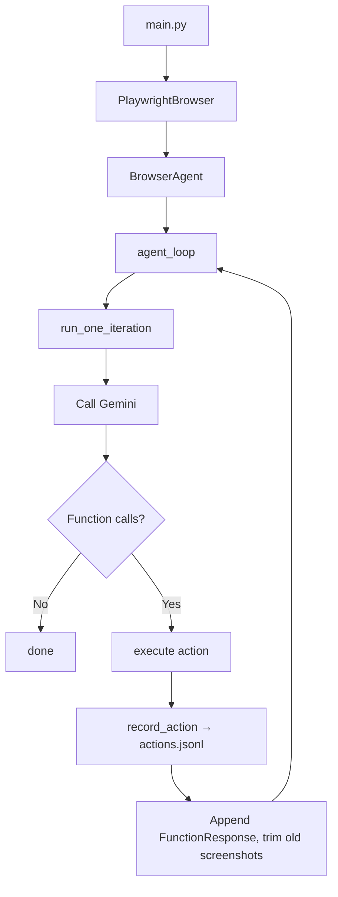

# tiny-browser-agent

Browser agent powered by Gemini Computer Use. Runs as a CLI using Playwright.

## Requirements

- Python `>=3.12,<3.13`
- `uv`
- Gemini API key

## Quick Start

```bash
uv sync --dev
uv run playwright install chromium
export GEMINI_API_KEY="YOUR_GEMINI_API_KEY"
uv run main.py "Summarize this page"
```

If Playwright needs system packages:

```bash
uv run playwright install-deps chromium
```

## Usage

```bash
uv run main.py "Open Example Domain and summarize the page"
uv run main.py "Summarize this page" --initial_url "https://example.com"
uv run main.py "Summarize this page" --headless True
uv run main.py "Click the first link" --highlight_mouse
uv run main.py "오늘 서울 날씨 알려줘" --log
```

### Session logging

`--log` writes artifacts under `logs/history/<timestamp>/`:

```text
actions.jsonl        # action history (one JSON record per step)
history/step-*.png   # screenshot per step
history/step-*.html  # DOM snapshot
history/step-*.json  # step metadata
video/               # Playwright recording (session_60fps.mp4 if ffmpeg available)
```

Each `actions.jsonl` entry:

```json
{"timestamp": 1234567890.0, "tool": "click_at", "args": {"x": 500, "y": 300}, "result_summary": "https://example.com"}
```

## CLI Reference

| Argument | Description | Default |
| - | - | - |
| `query` | Agent instruction (positional). | required |
| `--initial_url` | Starting page. | `https://www.google.com` |
| `--highlight_mouse` | Highlight cursor in screenshots. | `False` |
| `--headless` | Launch Playwright headless (`True`/`False`). | `False` |
| `--log` | Save video + per-step history + action history. | `False` |
| `--model` | LLM model name. | `gemini-2.5-computer-use-preview-10-2025` |

## Environment Variables

| Variable | Description |
| - | - |
| `GEMINI_API_KEY` | Gemini Developer API key. |
| `ACTION_SUMMARY_PROVIDER` | `openai` or `openrouter`. Inferred from the matching API key if omitted. |
| `ACTION_SUMMARY_MODEL` | Summarizer model (default `gpt-4o-mini`). |
| `ACTION_SUMMARY_TIMEOUT_SECONDS` | Summarizer timeout (default `15`). |
| `OPENAI_API_KEY` / `OPENAI_BASE_URL` | OpenAI key and optional base URL. |
| `OPENROUTER_API_KEY` / `OPENROUTER_BASE_URL` | OpenRouter key and optional base URL. |
| `COMPUTER_USE_FFMPEG_COMMAND` | Path to ffmpeg binary for video recording. |

## Project Layout

- `main.py` — CLI entry point
- `src/agents/` — `BrowserAgent`, `agent_loop()`, post-step summarizer
- `src/browser/` — `PlaywrightBrowser`, `ArtifactLogger`
- `src/llm/` — LLM client, provider bootstrap, retry
- `src/tools/` — custom browser action functions
- `src/tool_executor.py` — tool dispatch and serialization
- `tests/` — pytest suite

## Agent Pipeline



## Development

```bash
uv run pytest
uv run main.py --help
```

## Security Notes

- Use env vars for secrets; do not hardcode.
- `--log` writes screenshots, DOM snapshots, video, and action history under `logs/history/` — they may capture sensitive content and URLs.
- The Playwright backend keeps the browser sandbox enabled.
