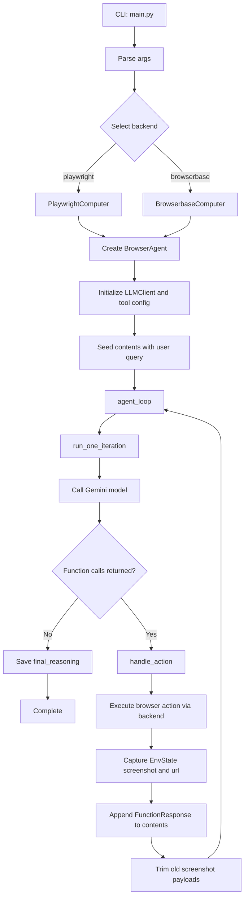
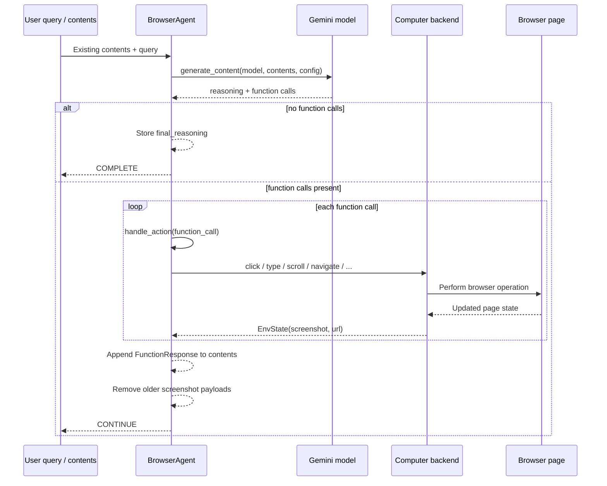

# Computer Use Preview

Browser agent example for Gemini Computer Use with two browser backends:

- `playwright`: local Chromium controlled by Playwright
- `browserbase`: remote browser session via Browserbase

The CLI entry point is `main.py`. Runtime code lives in `src/`.

## Local UI Mode

This project also includes a local FastAPI + React UI for polling session state, screenshots, reasoning, actions, and artifacts.

Backend:

```bash
uv sync --dev
uv run playwright install chromium
export GEMINI_API_KEY="YOUR_GEMINI_API_KEY"
uv run python main.py --ui --headless True
```

Frontend:

```bash
cd web
npm install
npm run dev
```

The Vite dev server proxies `/api` requests to the FastAPI backend at `http://127.0.0.1:8000`.

## Requirements

- Python `>=3.12,<3.13`
- `uv`
- A Gemini API key or Vertex AI credentials
- For Browserbase: `BROWSERBASE_API_KEY` and `BROWSERBASE_PROJECT_ID`

## Quick Start

```bash
uv sync --dev
uv run playwright install chromium
export GEMINI_API_KEY="YOUR_GEMINI_API_KEY"
uv run python main.py --env playwright --query "Summarize this page"
```

If Playwright needs system packages on your machine, run:

```bash
uv run playwright install-deps chromium
```

## Configuration

### Gemini Developer API

```bash
export GEMINI_API_KEY="YOUR_GEMINI_API_KEY"
```

### Vertex AI

```bash
export USE_VERTEXAI=true
export VERTEXAI_PROJECT="YOUR_PROJECT_ID"
export VERTEXAI_LOCATION="YOUR_LOCATION"
```

### Browserbase

```bash
export BROWSERBASE_API_KEY="YOUR_BROWSERBASE_API_KEY"
export BROWSERBASE_PROJECT_ID="YOUR_BROWSERBASE_PROJECT_ID"
```

## Usage

Basic command:

```bash
uv run python main.py --query "Go to Google and search for Gemini Computer Use"
```

### Playwright

Run locally with Playwright:

```bash
uv run python main.py \
  --env playwright \
  --query "Open Example Domain and summarize the page"
```

Start from a specific URL:

```bash
uv run python main.py \
  --env playwright \
  --initial_url "https://example.com" \
  --query "Summarize this page"
```

Run headless:

```bash
uv run python main.py \
  --env playwright \
  --headless True \
  --query "Summarize this page"
```

Show cursor highlighting for visual debugging:

```bash
uv run python main.py \
  --env playwright \
  --highlight_mouse \
  --query "Click the first link"
```

### Session Logging

Add `--log` to save Playwright execution artifacts:

```bash
uv run python main.py \
  --env playwright \
  --log \
  --query "Summarize this page"
```

This creates a timestamped directory under `logs/history/`:

```text
logs/history/<timestamp>/
├── history/
│   ├── step-0001.png
│   ├── step-0001.html
│   ├── step-0001.json
│   └── ...
└── video/
    └── <playwright-video-file>
```

- `history/*.png`: screenshot captured for each agent step
- `history/*.html`: DOM snapshot for each step
- `history/*.json`: step metadata including URL and file names
- `video/`: Playwright session recording

`--log` is only supported with `--env playwright`.

### Browserbase

Run against Browserbase:

```bash
uv run python main.py \
  --env browserbase \
  --query "Open Example Domain and summarize the page"
```

## CLI Reference

```text
usage: main.py [-h] --query QUERY [--env {playwright,browserbase}]
               [--ui] [--ui_host UI_HOST] [--ui_port UI_PORT]
               [--initial_url INITIAL_URL] [--highlight_mouse]
               [--headless HEADLESS] [--log] [--model MODEL]
```

| Argument | Description | Default |
| - | - | - |
| `--query` | Natural-language instruction for the agent. Required unless `--ui` is set. | Optional |
| `--ui` | Run the FastAPI UI backend instead of the CLI agent loop. | `False` |
| `--ui_host` | Host used by the FastAPI UI backend. | `127.0.0.1` |
| `--ui_port` | Port used by the FastAPI UI backend. | `8000` |
| `--env` | Browser backend to use: `playwright` or `browserbase`. | `playwright` |
| `--initial_url` | Initial page opened before the agent starts. | `https://www.google.com` |
| `--highlight_mouse` | Highlight cursor position in Playwright screenshots. | `False` |
| `--headless` | Launch Playwright headless. Use `True` or `False`. | `False` |
| `--log` | Save Playwright video and per-step DOM/screenshot history. | `False` |
| `--model` | Model name passed to the configured LLM provider. | `gemini-2.5-computer-use-preview-10-2025` |

## Environment Variables

| Variable | Description |
| - | - |
| `GEMINI_API_KEY` | API key for the Gemini Developer API. |
| `USE_VERTEXAI` | Set to `true` or `1` to use Vertex AI instead of the Gemini Developer API. |
| `VERTEXAI_PROJECT` | Vertex AI project ID. |
| `VERTEXAI_LOCATION` | Vertex AI location. |
| `BROWSERBASE_API_KEY` | Browserbase API key. |
| `BROWSERBASE_PROJECT_ID` | Browserbase project ID. |

## Project Layout

- `main.py`: CLI entry point and backend selection
- `src/agent.py`: `BrowserAgent`, browser-action orchestration, `agent_loop()`, and `run_one_iteration()`
- `src/llm/client.py`: app-facing LLM client with provider selection and bounded retry handling
- `src/llm/provider/`: Gemini API and Vertex AI provider bootstrap implementations
- `src/computers/computer.py`: shared `Computer` interface and `EnvState`
- `src/computers/playwright/playwright.py`: local Playwright backend
- `src/computers/browserbase/browserbase.py`: Browserbase backend
- `tests/test_main.py`: CLI tests
- `tests/test_agent.py`: agent behavior tests
- `tests/test_playwright_logging.py`: Playwright logging tests

## Agent Pipeline

The runtime flow starts in `main.py`, selects a browser backend, initializes `BrowserAgent`, and then loops until the model stops issuing browser actions.



### Per-iteration flow



Key responsibilities:

- `main.py`: parses CLI arguments, chooses `playwright` or `browserbase`, and starts the outer loop.
- `src/agent.py`: owns action dispatch, conversation state, and iteration control.
- `src/llm/client.py`: owns provider bootstrap, model request execution, and bounded retry handling.
- `src/computers/playwright/playwright.py`: executes local browser actions and captures screenshots/DOM history.
- `src/computers/browserbase/browserbase.py`: connects the same action model to a remote Browserbase session.

## Development

Run tests:

```bash
uv run pytest
```

Inspect CLI options:

```bash
uv run python main.py --help
```

## Security Notes

- Do not hardcode secrets; use environment variables instead.
- `--log` stores screenshots, DOM snapshots, metadata, and Playwright video under `logs/history/<timestamp>/`, which may capture sensitive content and URLs.
- UI sessions also write screenshots and HTML/JSON artifacts under `logs/history/ui/<session-id>/`, and can capture sensitive page content and URLs while a session is running.
- The local Playwright backend keeps the browser sandbox enabled.
