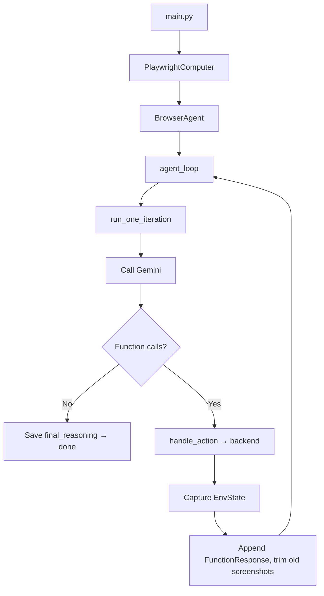

# Computer Use Preview

Browser agent for Gemini Computer Use. Runs as a CLI or an Electron desktop shell.

Backends:

- `playwright`: local Chromium
- `electron_surface`: hosted `WebContentsView` in the desktop shell

## Requirements

- Python `>=3.12,<3.13`
- `uv`
- Gemini API key

## Quick Start

```bash
uv sync --dev
uv run playwright install chromium
export GEMINI_API_KEY="YOUR_GEMINI_API_KEY"
uv run python main.py --env playwright --query "Summarize this page"
```

If Playwright needs system packages:

```bash
uv run playwright install-deps chromium
```

## Desktop Shell

Electron shell under `desktop/` runs the React renderer against a stdio Python bridge.

- `main` starts the bridge via `uv run python main.py --desktop_bridge --headless True`
- `preload` installs `window.__COMPUTER_USE_DESKTOP_BRIDGE__`
- Electron hosts a `WebContentsView` as the browser surface; the renderer forwards bounds/focus through `browserSurface.setBounds()` / `browserSurface.focus()`
- The Python runtime drives that surface through `ElectronSurfaceComputer`

Renderer loading:

- Dev: `ELECTRON_RENDERER_URL=http://127.0.0.1:5173`
- Prod: `web/dist/index.html`

Run:

```bash
cd desktop
npm install
npm run build
npm run start
```

Dev (renderer + shell):

```bash
cd web && npm install && npm run dev
cd ../desktop && npm install && npm run dev
```

Note: browser mode in the standalone web renderer is not a supported runtime path unless a client is injected explicitly.

## Configuration

### Gemini Developer API

```bash
export GEMINI_API_KEY="YOUR_GEMINI_API_KEY"
```

### Action-step summarizer (optional)

Gemini drives actions; the summarizer only rewrites executed steps into short user-facing text. Auto-enables from `OPENAI_API_KEY` or `OPENROUTER_API_KEY`; falls back to built-in summaries on failure.

```bash
export OPENAI_API_KEY="YOUR_OPENAI_API_KEY"
export ACTION_SUMMARY_MODEL="gpt-4o-mini"  # optional
```

## Usage

```bash
uv run python main.py --query "Open Example Domain and summarize the page"
uv run python main.py --initial_url "https://example.com" --query "Summarize this page"
uv run python main.py --headless True --query "Summarize this page"
uv run python main.py --highlight_mouse --query "Click the first link"
```

### Session logging

`--log` writes artifacts under `logs/history/<timestamp>/`:

```text
history/step-*.png   # screenshot per step
history/step-*.html  # DOM snapshot
history/step-*.json  # step metadata
video/               # Playwright recording
```

## CLI Reference

| Argument | Description | Default |
| - | - | - |
| `--query` | Agent instruction. Required unless `--desktop_bridge`. | — |
| `--desktop_bridge` | Run the stdio desktop bridge. | `False` |
| `--initial_url` | Starting page. | `https://www.google.com` |
| `--highlight_mouse` | Highlight cursor in screenshots. | `False` |
| `--headless` | Launch Playwright headless. | `False` |
| `--log` | Save Playwright video + per-step history. | `False` |
| `--model` | LLM model name. | `gemini-2.5-computer-use-preview-10-2025` |

## Environment Variables

| Variable | Description |
| - | - |
| `GEMINI_API_KEY` | Gemini Developer API key. |
| `ACTION_SUMMARY_PROVIDER` | `openai` or `openrouter`. Inferred from the matching API key if omitted. |
| `ACTION_SUMMARY_MODEL` | Summarizer model (default `gpt-4o-mini`). |
| `ACTION_SUMMARY_TIMEOUT_SECONDS` | Summarizer timeout (default `15`). |
| `OPENAI_API_KEY` / `OPENAI_BASE_URL` | OpenAI key and optional base URL. |
| `OPENROUTER_API_KEY` / `OPENROUTER_BASE_URL` | OpenRouter key and optional base URL. |
| `OPENROUTER_HTTP_REFERER` / `OPENROUTER_TITLE` | Optional OpenRouter headers. |

## Project Layout

- `main.py` — CLI entry point and backend selection
- `src/agent.py` — `BrowserAgent`, `agent_loop()`, `run_one_iteration()`
- `src/llm/` — LLM client, provider bootstrap, retry
- `src/computers/computer.py` — `Computer` interface and `EnvState`
- `src/computers/playwright/playwright.py` — Playwright backend
- `src/computers/electron_surface.py` — Electron hosted-surface backend
- `src/browser_actions.py` — custom actions registered alongside Computer Use
- `tests/` — pytest suite

## Agent Pipeline

`main.py` builds a `BrowserAgent` with the Playwright backend and loops until the model stops issuing actions.



## Action Spaces

Coordinates `x`, `y` are normalized to `0-1000` and rescaled to the backend's `screen_size()`.

### Predefined (`src/computers/computer.py`)

| Action | Arguments | Description |
| - | - | - |
| `open_web_browser` | — | Opens the browser. |
| `click_at` | `x`, `y` | Click at a coordinate. |
| `hover_at` | `x`, `y` | Hover at a coordinate. |
| `type_text_at` | `x`, `y`, `text`, `press_enter`, `clear_before_typing` | Type text; optionally press Enter / clear first. |
| `scroll_document` | `direction` | Scroll the page. |
| `scroll_at` | `x`, `y`, `direction`, `magnitude` | Scroll a region. |
| `wait_5_seconds` | — | Wait 5s. |
| `go_back` / `go_forward` | — | History navigation. |
| `search` | — | Jump to a search home page. |
| `navigate` | `url` | Navigate to URL. |
| `key_combination` | `keys` | E.g. `control+c`. |
| `drag_and_drop` | `x`, `y`, `destination_x`, `destination_y` | Drag source → destination. |
| `current_state` | — | Return `EnvState`. |

### Custom (`src/browser_actions.py`)

| Action | Arguments | Description |
| - | - | - |
| `press_key` | `key` | Press a single key (no modifiers). |
| `reload_page` | — | Reload current page. |
| `get_accessibility_tree` | — | Serialized a11y tree; no screenshot. |
| `upload_file` | `x`, `y`, `path` | Upload a local file to an `<input type="file">`. |

## Development

```bash
uv run pytest
uv run python main.py --help
```

## Security Notes

- Use env vars for secrets; do not hardcode.
- `--log` and UI sessions write screenshots, DOM snapshots, and video under `logs/history/` — they may capture sensitive content and URLs.
- The Playwright backend keeps the browser sandbox enabled.
