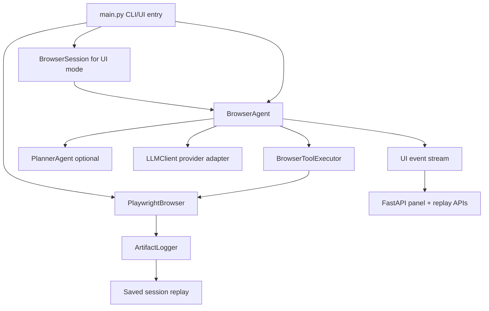

# tiny-browser-agent

**A diagnosis and debugging workbench for browser agents.**

`tiny-browser-agent` is not positioned as a SOTA browser-agent benchmark entry or
as a universal autonomous web operator. Its purpose is narrower and more useful
for agent builders: run browser-agent tasks, capture every step, and inspect why
the agent succeeded, failed, retried, drifted out of scope, or chose a specific
tool call.

Use it to debug browser-agent behavior with replayable evidence: model context,
raw model responses, tool calls, ARIA snapshots, screenshots, before/after
artifacts, action GIFs, videos, and a URL → viewport → action trajectory graph.

## What this project is for

- Diagnose browser-agent failures and regressions.
- Compare grounding modes (`text`, `vision`, `mixed`) and model/provider behavior.
- Inspect the exact model input/output for each action step.
- Replay saved sessions without rerunning the task.
- Collect reproducible traces for prompt, tool, planner, and UI debugging.
- Run benchmark-like batches for trace collection, not leaderboard claims.

## What this project is not

- Not a claim of SOTA web-agent performance.
- Not a production RPA platform.
- Not a headless-only benchmark harness optimized for maximum task success.
- Not a replacement for site-specific automation when deterministic automation is
  required.

## Key capabilities

### Browser-agent runtime

- Local Chromium control through Playwright.
- CLI task execution or long-lived web UI session.
- Configurable model providers through a common LLM boundary:
  OpenRouter, OpenAI, Gemini, and NVIDIA-compatible chat completion APIs.
- Grounding modes:
  - `text`: ARIA snapshot + stable integer refs.
  - `vision`: screenshot/coordinate actions.
  - `mixed`: ARIA refs plus screenshot input.
- Optional planner mode that decomposes a task into verifiable subgoals and can
  re-plan after subgoal failure.
- Task-scope guards for site-specific requests so the agent reports blockers
  instead of silently escaping to generic search.
- Cooperative UI interruption for stopping an active task safely.

### Diagnosis artifacts

With `--log`, every run can persist:

```text
logs/history/<timestamp>/
├── session.json          # task, model, grounding, planner, constraints
├── events.jsonl          # replayable UI/model/tool event stream
├── actions.jsonl         # compact action trajectory
└── history/
    ├── step-0001.png     # viewport screenshot
    ├── step-0001.html    # DOM snapshot
    ├── step-0001.a11y.yaml
    ├── step-0001.json    # metadata, state graph, review metadata
    ├── step-0001.gif     # before/after GIF when ffmpeg is available
    └── step-0001-action.gif
```

With `--video`, the run can also persist:

```text
logs/history/<timestamp>/video/
├── <playwright-recording>.webm
└── session_60fps.mp4     # when ffmpeg is available
```

### Web control panel

`--ui` starts a local FastAPI/uvicorn panel for live diagnosis:

- Submit tasks and stop the active task from a single Run/Stop control.
- See planner/subgoal progress.
- Inspect the action timeline.
- Drill into a hierarchical trajectory graph:
  URL → viewport state → action step.
- Compare before/after screenshots and action GIFs.
- Open raw LLM context and raw response for each step.
- Replay previous sessions from `logs/history/<timestamp>/`.

## Requirements

- Python `>=3.12,<3.13`
- [`uv`](https://docs.astral.sh/uv/)
- Chromium browser binary installed through Playwright
- API key for the configured model provider
- Optional: `ffmpeg` for GIF/MP4 artifact generation

## Setup

```bash
uv sync --dev
uv run playwright install chromium
```

If your machine needs Playwright system packages:

```bash
uv run playwright install-deps chromium
```

Configure provider credentials as needed. The checked-in `config.yaml` controls
the default actor, planner, summary providers, and execution budgets.

```bash
export OPENROUTER_API_KEY="..."
export OPENAI_API_KEY="..."      # used when the summary provider is OpenAI
export GEMINI_API_KEY="..."      # needed only when using Gemini configs
export NVIDIA_API_KEY="..."      # needed only when using NVIDIA configs
```

## Quick start

Run a one-off task:

```bash
uv run main.py "Open Example Domain and summarize the page"
```

Start from a specific URL:

```bash
uv run main.py "Summarize this page" --initial_url "https://example.com"
```

Run with diagnostic artifacts:

```bash
uv run main.py "Search for Playwright docs and summarize the result" --log
```

Run with the browser control/debugging panel:

```bash
uv run main.py --ui --planner --log --highlight_mouse
```

Or use the bundled local UI script:

```bash
scripts/run.sh
```

## CLI reference

`query` is positional and is omitted only when using `--ui`.

| Argument | Description | Default |
| --- | --- | --- |
| `query` | Browser-agent instruction. | Required unless `--ui` |
| `--ui` | Start the local web control panel. | `False` |
| `--env` | Browser backend. Currently only `playwright`. | `playwright` |
| `--initial_url` | Initial page loaded in the browser. | `https://www.duckduckgo.com` |
| `--search_engine_url` | URL used by the `search` tool. | `https://www.duckduckgo.com` |
| `--highlight_mouse` | Draw clicked-element and pointer-location highlights in screenshots. | `False` |
| `--headless` | Launch Playwright headless (`True`/`False`). | `False` |
| `--screen-size` | Browser size as `WIDTHxHEIGHT`, or `auto`. | `auto`, fallback `1600x900` |
| `--log` | Save per-step screenshots, DOM, ARIA, events, GIFs, and action JSONL. | `False` |
| `--video` | Save Playwright video and optional MP4 stream. | `False` |
| `--model` | Override the actor model from `config.yaml`. | `models.actor.model` |
| `--grounding` | `text`, `vision`, or `mixed`. | `text` |
| `--planner` | Use `PlannerAgent` subgoal decomposition/replanning. | `False` |
| `--stealth` | Inject anti-automation browser patches. | `False` |
| `--channel` | Playwright browser channel such as `chrome` or `msedge`. | Playwright default Chromium |
| `--locale` | Browser locale, for example `ko-KR`. | unset |
| `--timezone` | IANA timezone id, for example `Asia/Seoul`. | unset |
| `--user-agent` | Override browser User-Agent. | unset |
| `--proxy` | Proxy URL: `scheme://[user:pass@]host:port`. | unset |
| `--storage-state` | Playwright storage state JSON, loaded on start and saved on exit. | unset |

## Configuration

Runtime defaults live in `config.yaml`.

```yaml
models:
  actor:
    provider: openrouter
    model: ...
  planner:
    provider: openrouter
    model: ...
  summary:
    provider: openai
    model: gpt-4o-mini

constraints:
  max_steps_per_subgoal: 30
  max_total_steps: 500
  max_subgoals: 20
```

Supported actor/planner providers:

- `openrouter`
- `openai`
- `gemini`
- `nvidia`

Supported summary providers:

- `openai`
- `openrouter`
- `nvidia`

## Environment variables

| Variable | Used for |
| --- | --- |
| `OPENROUTER_API_KEY`, `OPENROUTER_BASE_URL` | OpenRouter actor/planner/summary configs. |
| `OPENAI_API_KEY`, `OPENAI_BASE_URL` | OpenAI actor/planner/summary configs. |
| `GEMINI_API_KEY` | Gemini actor/planner configs. |
| `NVIDIA_API_KEY`, `NVIDIA_BASE_URL` | NVIDIA-compatible chat completion configs. |
| `NVIDIA_THINKING`, `NVIDIA_REASONING_EFFORT` | NVIDIA reasoning controls. |
| `ACTION_SUMMARY_PROVIDER` | Override action summary provider. |
| `ACTION_SUMMARY_MODEL` | Override action summary model. |
| `ACTION_SUMMARY_TIMEOUT_SECONDS` | Timeout for action summary generation. |
| `COMPUTER_USE_FFMPEG_COMMAND` | Explicit ffmpeg binary path for GIF/video encoding. |
| `USE_PATCHRIGHT=1` | Try Patchright before falling back to Playwright import. |

## Architecture


```mermaid
flowchart TD
    CLI[main.py CLI/UI entry] --> Browser[PlaywrightBrowser]
    CLI --> Session[BrowserSession for UI mode]
    Session --> Agent[BrowserAgent]
    CLI --> Agent
    Agent --> Planner[PlannerAgent optional]
    Agent --> LLM[LLMClient provider adapter]
    Agent --> Tools[BrowserToolExecutor]
    Tools --> Browser
    Browser --> Artifacts[ArtifactLogger]
    Agent --> Events[UI event stream]
    Events --> Panel[FastAPI panel + replay APIs]
    Artifacts --> Replay[Saved session replay]
```

Important modules:

- `main.py` — CLI parser, browser setup, CLI/UI mode selection.
- `src/agents/actor_agent.py` — main browser-agent loop and event emission.
- `src/agents/planner_agent.py` — JSON subgoal planner and replanner.
- `src/agents/subgoal_runner.py` — planner subgoal execution glue.
- `src/llm/client.py` — provider selection, declarations, retries.
- `src/llm/provider/` — Gemini, OpenAI, OpenRouter, NVIDIA adapters.
- `src/browser/playwright.py` — Playwright browser control, ARIA snapshots,
  tabs, upload guards, state capture, recording hooks.
- `src/browser/artifact_logger.py` — session, event, action, screenshot, DOM,
  GIF, and metadata persistence.
- `src/browser/state.py` — hierarchical `BrowserState` model.
- `src/browser/state_graph.py` — state graph metadata used by the UI.
- `src/tool_executor.py` — browser tool declaration/execution boundary.
- `src/tools/` — individual browser action handlers and descriptors.
- `src/ui/server.py` — FastAPI panel server and task/interrupt endpoints.
- `src/ui/bridge.py` — thread-safe event/task bridge.
- `src/ui/replay.py` — saved session listing, replay event loading, artifacts.
- `src/ui/static/` and `src/ui/panel.html` — browser debugging UI.
- `scripts/batch_runner.py` — Hugging Face dataset task runner for trace
  collection.

## Browser state model

Browser actions return a hierarchical `BrowserState`:

```text
BrowserState
├── PageState(url, title, html_path, a11y_path)
├── ViewportState(screenshot, width, height, scroll_x, scroll_y)
└── InteractionState(focused_element, available_refs, last_action)
```

`EnvState` remains as a compatibility subclass for existing tool/agent contracts.

## Batch trace collection

The batch runner can load web-agent tasks from Hugging Face datasets-server and
run each task through the local agent:

```bash
uv run python scripts/batch_runner.py \
  --dataset convergence-ai/WebVoyager2025Valid \
  --limit 10 \
  --workers 2 \
  --log-agent
```

The repository also includes `scripts/run_batch.sh`, configured for Korean
online Mind2Web-style task traces. Treat these scripts as debugging-data
collection tools: they are useful for gathering failures and comparing traces,
not for making SOTA claims.

## Development

Run the test suite:

```bash
uv run pytest
```

Inspect CLI flags:

```bash
uv run main.py --help
```

Install/update dependencies:

```bash
uv sync --dev
```

## Security and privacy notes

- Do not hardcode API keys; use environment variables.
- `--log` and `--video` can capture sensitive page content, URLs, DOM,
  accessibility trees, model prompts, tool results, screenshots, and videos.
- Review `logs/history/<timestamp>/` before sharing artifacts.
- The local Playwright backend intentionally keeps the browser sandbox enabled.
- File upload is guarded to paths under the current working directory or system
  temp directory unless `allowed_upload_roots` is changed in code.

## Project status

This project is intentionally small and instrumentation-heavy. Its value is in
making browser-agent behavior observable and reproducible, so future work should
prioritize clearer traces, better failure classification, replay fidelity, and
debugging UX over benchmark-specific optimizations.
