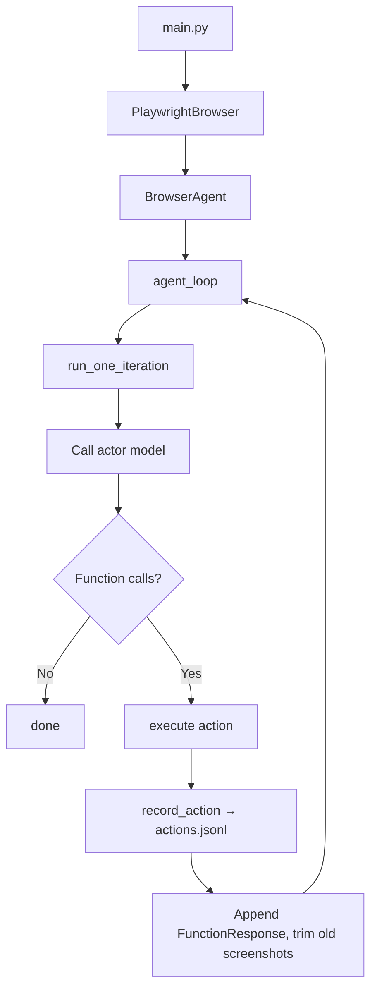

# tiny-browser-agent

Browser agent CLI built with Playwright and configurable LLM providers.

## Requirements

- Python `>=3.12,<3.13`
- `uv`
- API keys for the configured providers

## Quick Start

```bash
uv sync --dev
uv run playwright install chromium
export OPENROUTER_API_KEY="YOUR_OPENROUTER_API_KEY"
export GEMINI_API_KEY="YOUR_GEMINI_API_KEY"
uv run main.py "Summarize this page"
```

If Playwright needs system packages:

```bash
uv run playwright install-deps chromium
```

## Usage

```bash
uv run main.py "Open Example Domain and summarize the page"
uv run main.py "Summarize this page" --initial_url "https://example.com"
uv run main.py "Summarize this page" --headless True
uv run main.py "Click the first link" --highlight_mouse
uv run main.py "오늘 서울 날씨 알려줘" --log
```

### Session logging

`--log` writes artifacts under `logs/history/<timestamp>/`:

```text
session.json         # task/model metadata for replay listings
events.jsonl         # faithful UI event stream for replay
actions.jsonl        # action history (one JSON record per step)
history/step-*.png   # screenshot per step
history/step-*.html  # DOM snapshot
history/step-*.json  # step metadata
video/               # Playwright recording (session_60fps.mp4 if ffmpeg available)
```

New logged sessions include `events.jsonl`, which lets the web UI replay the same
timeline, plan, activity, and navigation graph that appeared during the live run.
Start `uv run main.py --ui --log`, click **Sessions** in the header, and select a
saved `logs/history/<timestamp>/` entry to replay it with pause, step, speed, and
progress controls. Older sessions without `events.jsonl` are replayed from a
synthetic stream built from `actions.jsonl` and `history/step-*.json`.

Each `actions.jsonl` entry:

```json
{"timestamp": 1234567890.0, "tool": "click_at", "args": {"x": 500, "y": 300}, "result_summary": "https://example.com"}
```

## CLI Reference

| Argument | Description | Default |
| - | - | - |
| `query` | Agent instruction (positional). | required |
| `--initial_url` | Starting page. | `https://www.duckduckgo.com` |
| `--highlight_mouse` | Highlight cursor in screenshots. | `False` |
| `--headless` | Launch Playwright headless (`True`/`False`). | `False` |
| `--log` | Save video + per-step history + action history. | `False` |
| `--model` | Actor model name. | `models.actor.model` from `config.yaml` |
| `--grounding` | Page grounding mode: `text`, `vision`, or `mixed`. | `text` |
| `--planner` | Decompose the query into subgoals before execution. | `False` |

## Environment Variables

| Variable | Description |
| - | - |
| `OPENROUTER_API_KEY` / `OPENROUTER_BASE_URL` | OpenRouter key and optional base URL for the default actor. |
| `NVIDIA_API_KEY` / `NVIDIA_BASE_URL` | NVIDIA NIM-compatible OpenAI chat completions key and optional base URL. |
| `NVIDIA_THINKING` / `NVIDIA_REASONING_EFFORT` | NVIDIA chat template thinking controls (defaults: `true` / `high`). |
| `GEMINI_API_KEY` | Gemini Developer API key for the planner when `--planner` is enabled. |
| `ACTION_SUMMARY_PROVIDER` | `openai`, `openrouter`, or `nvidia`. Inferred from the matching API key if omitted. |
| `ACTION_SUMMARY_MODEL` | Summarizer model (default `gpt-4o-mini`). |
| `ACTION_SUMMARY_TIMEOUT_SECONDS` | Summarizer timeout (default `15`). |
| `OPENAI_API_KEY` / `OPENAI_BASE_URL` | OpenAI key and optional base URL. |
| `COMPUTER_USE_FFMPEG_COMMAND` | Path to ffmpeg binary for video recording. |

## Configuration Notes

Runtime model defaults live in `config.yaml`, not in fixed tests. This keeps the
project flexible while comparing OpenRouter, Gemini, OpenAI, or NVIDIA models.
In UI mode, model safety-confirmation requests are not routed through terminal
stdin; until the panel has an explicit confirmation control, those requests stop
the pending browser action instead of blocking the session thread.

## Project Layout

- `main.py` — CLI entry point
- `src/agents/` — `BrowserAgent`, `agent_loop()`, post-step summarizer
- `src/browser/` — `PlaywrightBrowser`, `ArtifactLogger`
- `src/llm/` — LLM client, provider bootstrap, retry
- `src/tools/` — custom browser action functions
- `src/tool_executor.py` — tool dispatch and serialization
- `tests/` — pytest suite

## BrowserState model

Browser actions now return a hierarchical `BrowserState` shape:

```text
BrowserState
├── PageState(url, title, html_path, a11y_path)
├── ViewportState(screenshot, width, height, scroll_x, scroll_y)
└── InteractionState(focused_element, available_refs, last_action)
```

`EnvState` remains available as a compatibility subclass, so existing imports and
`state.url` / `state.screenshot` access continue to work during migration.
Remove this shim only after all callers have migrated to `BrowserState.page.url`
and `BrowserState.viewport.screenshot`, and after the public tool/agent response
contract no longer accepts flat `EnvState(screenshot=..., url=...)` construction.

## Agent Pipeline


```mermaid
flowchart TD
    A[main.py] --> D[PlaywrightBrowser]
    D --> F[BrowserAgent]
    F --> G[agent_loop]
    G --> H[run_one_iteration]
    H --> I[Call actor model]
    I --> J{Function calls?}
    J -->|No| K[done]
    J -->|Yes| L[execute action]
    L --> M[record_action → actions.jsonl]
    M --> N[Append FunctionResponse, trim old screenshots]
    N --> G
```

## Development

```bash
uv run pytest
uv run main.py --help
```

## Security Notes

- Use env vars for secrets; do not hardcode.
- `--log` writes screenshots, DOM snapshots, video, and action history under `logs/history/` — they may capture sensitive content and URLs.
- The Playwright backend keeps the browser sandbox enabled.
